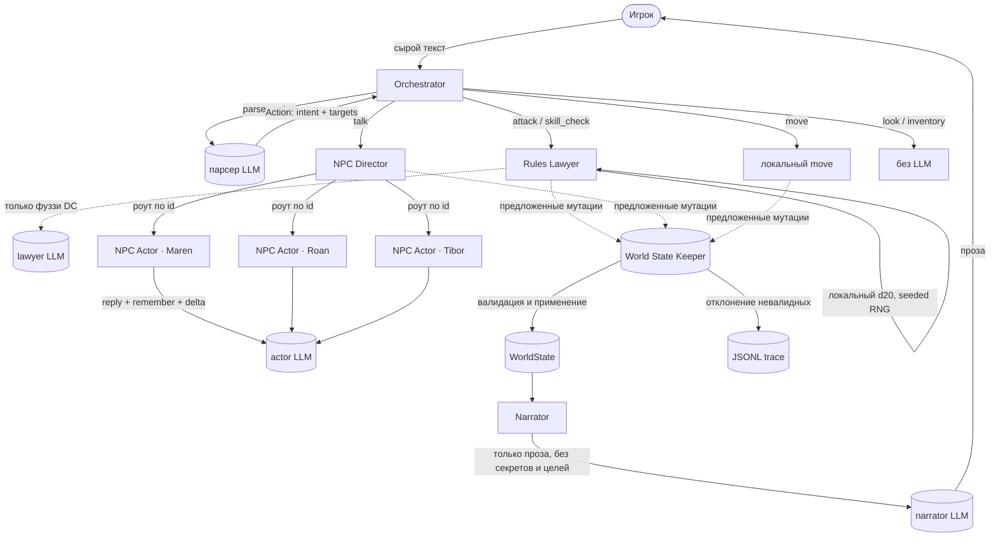
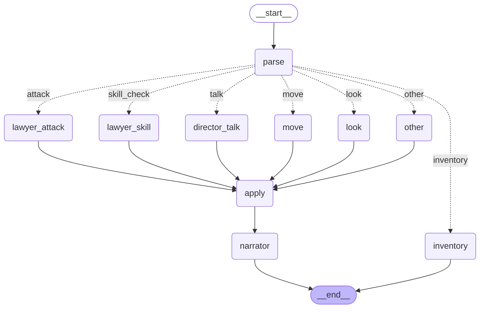

# TaleForge

[](https://www.python.org/)
[](#)
[](https://fastapi.tiangolo.com/)
[](https://react.dev/)
[](#)
[](#граф-вызовов-в-langgraph)

> Четыре специализированных LLM-агента играют в D&D, чтобы тебе не нужно было четырёх друзей.

Мульти-агентная текстовая RPG: маленький Orchestrator координирует **Хранителя
состояния мира**, **Судью правил**, **Режиссёра NPC** (который роутит на
агентов-исполнителей по одному на NPC) и **Рассказчика**, чтобы провести
соло-сессию в духе D&D прямо в терминале или браузере. Поверх `asyncio` +
`pydantic` + `httpx`; маршрутизация ходов — через **LangGraph StateGraph**.

Суть проекта не в том, что «LLM может играть в D&D» (может). Суть в
**разделении ответственности**: каждый агент отвечает строго за одну вещь, а
канонический мир имеет ровно одного писателя. LangGraph даёт визуализируемый
граф вызовов, явный TypedDict-state между нодами и точку расширения, когда
маршрутизация со временем перестанет быть статической.

---

## Архитектура



**Пять правил, на которых всё держится** (зафиксированы тестами в `tests/`):

1. **Только Keeper пишет в state.** Остальные агенты *предлагают* мутации в
   формате tool-call (`{op, args}`); Keeper валидирует их против текущего
   состояния и либо применяет, либо отклоняет.
2. **Рассказчик не видит секретов.** Его вход отфильтрован до публичных
   фактов, видимой сцены (HP в виде слов, не чисел) и последних 3 абзацев
   прозы.
3. **Одна голова на одного персонажа.** NPC Director — это роутер, а не
   мульти-характерный актёр. У каждого NPC свой системный промпт и своя
   история разговора; один LLM-вызов никогда не играет за двоих.
4. **Кости бросаются локально.** `random.Random(seed, turn, *salts)` из
   `WorldState.rng_seed` делает каждый бросок воспроизводимым. LLM зовётся
   только для определения нечётких DC у скилл-чеков.
5. **Граф вызовов детерминирован для каждого интента.** Ни один агент сам не
   «решает» позвать другого. Switch в Orchestrator — 30 строк.

---

## Быстрый старт

```bash
# 1. Python-часть
git clone https://github.com/NikitaSergeev07/TaleForge.git && cd TaleForge
pip install -e ".[dev]"     # `uv sync` тоже работает

# 2. Конфиг
cp .env.example .env
# Открой .env и вставь свой токен gngn.my

# 3. Проверка
pytest                       # 87 тестов, ~10 сек

# 4а. Играть в терминале
taleforge new --scenario starter_village
# Вернёт session id вида starter_village-1715639500
taleforge play starter_village-1715639500

# 4б. Или играть в браузере
# Терминал A — бэкенд:
uvicorn taleforge.web.server:app --port 8000
# Терминал B — фронтенд:
cd frontend && npm install && npm run dev
# Открой http://localhost:5173
```

В **CLI** play-loop:

```
> осмотрись вокруг
> атакуй жуткого волка
> спроси Марен про волков
> /save
> /quit
```

Slash-команды (обрабатываются локально, без LLM):
`/save` `/quit` `/state` `/inv` `/undo` `/rolls` `/help`.

В **веб-интерфейсе**: пиши свободный текст в центре, кликай по чипам-подсказкам,
смотри как карта мира подсвечивает твоё текущее местоположение, наводи на
карточки NPC справа чтобы увидеть disposition / HP / флаг «помнит тебя»,
смотри боевой оверлей при каждом броске на атаку.

---

## Пример прохождения

> *5 реальных ходов из прогона `taleforge bench` на стартовом сценарии. Проза
> verbatim от `opus-4-7` через шлюз gngn.my.*

```
> look around
```
> Brackenhollow's square unfolds around you. A chipped stone well anchors the
> center, its wooden bucket dangling from a fraying rope. Handbills crowd the
> notice board — faded wanted posters, a misplaced livestock notice, something
> about a lost cat — fluttering in the breeze. Wood-smoke drifts from somewhere
> to the east, threading through the afternoon air, and the rhythmic clang of
> the smithy echoes faintly from the same direction.
>
> A man in a patchwork cloak leans against the well, fingers dancing over the
> strings of a battered lute. Tibor the Bard, if the stories are true — and
> they usually aren't when they involve him.

```
> say hi to Maren
```
> The Boar & Barrel sits at the south end of the square, its weathered sign
> creaking in the wind. […] *Maren offers you a brief nod.* "Welcome to The
> Boar & Barrel, traveler! I'm Maren, and this is my establishment. What can
> I get you?"

```
> attack the dire wolf      [d20=18+4=22 против AC12 → попадание · 1d6+2=3 урона]
```
> The blade finds its mark. Your shortsword bites into the wolf's flank, a
> clean line of red opening across dark fur. The beast twists mid-lunge, more
> startled than hurt, and for a single heartbeat you see something flicker
> behind those yellow eyes — not fear, not yet, but a recalculation.

```
> attack the dire wolf again   [d20=16+4=20 против AC12 → попадание · 1d6+2=4 урона]
```
> The wolf's circling stutter-step betrays it. You lunge first, driving your
> shortsword past the guard of matted fur and into the wound already opened on
> its flank. Four more points of damage, the blade grinding against rib before
> sliding free.

```
> tell Elder Roan the wolf is dead
```
> The fire paints everything in shades of ember and shadow. […] She looks at
> you slowly, measuring. *"Dead. Already."* A long breath. *"And the pups?
> Still in the den, or did you root them out too?"* Her tone is hard to read —
> not quite grateful, not quite accusatory. *"The council will want proof,
> you know. Ears or a fang. For the bounty."*

И то же самое на русском (один LLM-вызов с language=ru):

```
> осмотрись вокруг
```
> Вы окидываете взглядом площадь Брекенхоллоу. Булыжники под ногами потемнели
> от времени, у самого края бьёт колодец с отколотым краем — вода в нём тихо
> покачивается от ветра. Доска объявлений увешана пёстрыми листовками, края
> которых трепещут на сквозняке. Из-за поворота к востоку доносится густой
> запах дыма от кузницы, и вместе с ним — мерный звон молота по наковальне.
>
> Неподалёку, прислонившись к краю колодца, стоит Тибор Бард — в цветастом
> колете и с лютней за спиной. Он замечает вас и слегка кивает, не прерывая
> настройку струн.

---

## Бенчмарк консистентности

`taleforge bench [session_id]` гоняет 30-ходовый скрипт через оркестратор, а
потом задаёт Хронисту (`haiku-4-5` в Q&A-режиме, на вход — только
история прозы Рассказчика, **без** доступа к state) десять фактологических
вопросов, чьи правильные ответы читаются напрямую из `WorldState`. Это
измеряет, насколько хорошо текстовая проза отражает реальное состояние мира.

### Реальный прогон на стартовом сценарии

| Метрика                       | Значение         |
|-------------------------------|------------------|
| Скриптованных ходов           | 30               |
| Мутаций применено             | 16               |
| Доля отклонённых мутаций      | 0% (0 / 16)      |
| Recall Рассказчика            | **40% (4 / 10)** |
| Стоимость прогона (opus + haiku) | **$2.87**        |
| Средняя стоимость хода        | ≈ $0.096         |

Покажу по вопросам:

| Вопрос                                | Истина (state)        | Ответ Рассказчика                                | ✓ |
|---------------------------------------|-----------------------|--------------------------------------------------|---|
| Жив ли жуткий волк?                   | `True`                | "Yes."                                           | ✓ |
| Жив ли Тибор?                         | `True`                | "Tibor the Bard is still alive."                 | ✓ |
| Где сейчас игрок?                     | `Village Square`      | "Hask's Smithy, inside the forge room…"          | ✗ |
| Сколько у игрока gp?                  | `10`                  | "8"                                              | ✗ |
| HP игрока?                            | `18`                  | "unknown"                                        | ✗ |
| Disposition Тибора?                   | `friendly`            | "warm"                                           | ✗ |
| Disposition Марен?                    | `friendly`            | "neutral"                                        | ✗ |
| Состояние квеста Howling Woods?       | `active`              | "active"                                         | ✓ |
| Узнал ли Тибор что-то об игроке?      | `False`               | "No."                                            | ✓ |
| Какой день в игре?                    | `1`                   | "unknown"                                        | ✗ |

**Как читать результат:** 40% — это честно, не «отлично». Где Рассказчик
выигрывает: бинарные факты (живой / квест активен / ничего нового не узнал).
Где проигрывает: **численное состояние, которое проза намеренно не
озвучивает** (gp count, точные HP, день) и **переходы между сценами, где
проза отстала от мутации** (последний `move` игрока применился к state, но
Рассказчик ещё не описал его в новой комнате).

Это и есть смысл бенчмарка: разница между «что произошло» и «что было
рассказано» — та самая дыра в консистентности, которую мульти-агентные
текстовые RPG обычно затирают своим существованием. Знать, что разрыв 40%
на 30-ходовом скрипте — полезная отправная точка.

Полный JSON-отчёт ложится в `traces/<session_id>_bench.json` со всеми
вопросами, истинами, ответами и оценками.

---

## Стоимость

По правилу #6 агенты делятся на два тира моделей:

| Агент          | Модель                | Зачем                       |
|----------------|------------------------|-----------------------------|
| Narrator       | `opus-4-7`     | Голос и качество прозы      |
| NPC Actor      | `opus-4-7`     | Голос персонажа важен       |
| NPC Director   | `haiku-4-5`    | Дешёвый роутинг             |
| Rules Lawyer   | `haiku-4-5`    | Дешёвый выбор DC            |
| Orchestrator   | `haiku-4-5`    | Дешёвый разбор интентов     |

Имена — логические; gngn.my-специфичные строки кладутся в `.env`
(`GATEWAY_OPUS_MODEL` и т.д.). Стоимость считается на лету в
`MinimaxClient.estimate_cost_usd` и показывается как поход на ход (в подвале
CLI), так и общая (в отчёте бенча).

Наблюдаемые стоимости из бенч-прогона выше (значения — верхняя граница;
реальный шлюз скорее всего дешевле):

| Интент / агент       | Типичная цена за ход | Что считается                            |
|----------------------|----------------------|------------------------------------------|
| `look`               | ≈ $0.06              | парсер (haiku) + narrator (opus)         |
| `move`               | ≈ $0.06–0.09         | парсер + narrator                        |
| `talk` (с NPC)       | ≈ $0.12–0.13         | парсер + actor (opus) + narrator         |
| `attack`             | ≈ $0.10              | парсер + lawyer (без LLM!) + narrator    |
| `skill_check`        | ≈ $0.08              | парсер + lawyer DC-set + narrator        |
| `inventory` (распарс)| ≈ $0.02              | только парсер, narrator пропускается     |
| `/inv` (слеш)        | **$0.00**            | напрямую из CLI, без LLM                 |

---

## Структура проекта

```
src/taleforge/
├── config.py               # frozen Settings, dotenv
├── models.py               # WorldState, Entity, NPC, Location, Quest, Action, Outcome
├── llm/
│   ├── minimax.py          # ЕДИНСТВЕННЫЙ async-клиент (retry, cost, reasoning)
│   └── prompts.py          # системные промпты (по одному на агента)
├── state/
│   ├── store.py            # WorldStateKeeper (единственный писатель) + загрузка YAML + SQLite-сейвы
│   └── tools.py            # 12 описаний мутаций с validate + apply
├── scenarios/
│   └── starter_village.yaml  # Brackenhollow: 6 локаций, 4 NPC, 1 квест
├── agents/
│   ├── base.py             # BaseAgent ABC
│   ├── orchestrator.py     # роутер player input → последовательность вызовов
│   ├── rules_lawyer.py     # локальные кости с seed + LLM только для фуззи DC
│   ├── narrator.py         # только проза; строгий фильтр на утечки
│   ├── npc_director.py     # роутит на агентов-исполнителей (без актёрской игры)
│   └── npc_actor.py        # ОДИН NPC, свой промпт + своя история
├── bench/consistency.py    # 30-ходовый скрипт + 10 фактов + scoring
├── cli.py                  # typer-entrypoint: new / play / load / bench
└── web/
    ├── server.py           # FastAPI: sessions, scene, turn, undo, world-map, npcs, portraits
    └── schemas.py          # DTO (отфильтрованы: НИКАКИХ секретов / целей / памяти не утекает)

frontend/                   # React 18 + Vite 4 + Tailwind 3 + framer-motion
├── src/
│   ├── App.tsx             # 3-панельный layout (карта / проза / NPC + инвентарь)
│   ├── api.ts              # обёртки fetch для /api/*
│   ├── types.ts            # отражают web/schemas.py
│   ├── i18n/               # словари en + ru, Context + хук useT, localStorage
│   └── components/
│       ├── Header.tsx          # ход / день / стоимость / undo / save / язык
│       ├── ProseFeed.tsx       # скроллящаяся история с framer-анимациями
│       ├── ActionInput.tsx     # input + чипы-подсказки
│       ├── WorldMap.tsx        # SVG-граф; текущая локация пульсирует огоньком
│       ├── NpcPanel.tsx        # карточки: портрет + HP + полоса disposition + бейдж "тут"
│       ├── InventoryPanel.tsx  # HP-бар, точки золотых, список вещей
│       ├── DiceFooter.tsx      # сворачиваемые броски последнего хода
│       └── CombatOverlay.tsx   # анимированная модалка боя: d20 → AC → −урон
```

Жёсткие правила (проверяются кодом, а не на словах):
- каждый файл агента ≤ 250 строк
- весь HTTP к шлюзу через ОДИН клиент (`llm/minimax.py`)
- каждая мутация state логируется в JSONL trace
- `.env.example` коммитится; `.env` и `traces/` в `.gitignore`

---

## Граф вызовов в LangGraph

Каждый ход — это один `graph.ainvoke` по `StateGraph`, который компилируется
один раз в `Orchestrator.__init__` и переиспользуется через все ходы сессии.
Описание графа живёт в [`src/taleforge/agents/graph.py`](src/taleforge/agents/graph.py)
и автоматически отрисовывается в эту mermaid-диаграмму:



Каждый узел — обычная Python-функция (синхронная или async), которая принимает
текущий `TurnState` (TypedDict) и возвращает delta-словарь. Сам `TurnState`
несёт: `raw_input`, `language`, `action`, `outcome`, `prose`,
`applied_mutations`, `rejected_mutations`. Никакого глобального state-объекта —
всё что нужно ноде, лежит в state-канале.

Несколько свойств, которые langgraph даёт сразу:

| Что                                       | Где это видно                                |
|-------------------------------------------|----------------------------------------------|
| auto-mermaid графа                        | `graph.get_graph().draw_mermaid()` ↑         |
| тесты на форму графа                      | `tests/test_graph.py` (6 lock-in-проверок)   |
| единственная точка применения мутаций     | узел `apply` — конвергируют все resolvers    |
| LLM в маршрутизаторе нет                  | `route_by_intent` — чистая функция           |
| легко добавить новую ветку (например narrator-react) | один `add_node` + `add_edge`        |
| будущий checkpointer / human-in-the-loop  | бесплатно из коробки langgraph               |

Если задача со временем потребует runtime-перезаписи графа (например, модель
сама решает следующего агента) — StateGraph остаётся, меняется только
содержимое edges.

---

## Локализация

Веб-интерфейс мультиязычный из коробки (английский + русский), переключатель
языка — в шапке. Выбор сохраняется в `localStorage`, при первом визите
определяется из `navigator.language`.

Поддержка на бэке: `POST /api/sessions` принимает поле `language: "en" | "ru"`;
`POST /api/sessions/{sid}/turn` может override его на одиночный ход. Язык
протекает через `Orchestrator.take_turn` → `Narrator.narrate` и `NPCActor.speak`,
где к системному промпту приклеивается строка, просящая модель писать на
выбранном языке.

YAML-сценарий остаётся английским (имена собственные типа Brackenhollow,
Maren, "The Boar & Barrel" — переводить было бы потерями). Рассказчик
транслитерирует их на лету (`Брекенхоллоу`, `Тибор Бард`, и т.д.).

Проверено end-to-end на `opus-4-7` через gngn.my: `осмотрись вокруг` →
атмосферный абзац на 280 символов на русском, $0.13 за ход (чуть дороже
английского, потому что модель больше думает на русском выводе).

Добавить ещё язык — один файл: положить строки в
`frontend/src/i18n/strings.ts` (у каждого ключа объект `{en, ru, …}`) и
дописать в `_LANG_NAMES` в `src/taleforge/llm/prompts.py`.

---

## Web-фронтенд — инварианты

Web-слой несёт те же правила утечек, что и Рассказчик. Три бэкенд-теста их
закрепляют:

- `NpcCardDTO` отдаёт `disposition_norm` (float -1..1 для отрисовки полосы)
  и `disposition_label` («friendly» / «wary»), но **никогда** — сырое
  число, цели, секреты или содержимое памяти.
- `SceneDTO.entities` включает только сущности в одной локации с игроком,
  и только их поля `id / name / kind / alive / hp_label` (HP в виде слова,
  целое число спрятано).
- `test_npc_cards_filter_secrets_and_goals` сканирует JSON-payload на те же
  девять секретных литералов, что и тесты Рассказчика.

Endpoint портретов возвращает SVG-инициалы с цветом, посчитанным по хэшу,
без LLM-вызовов (`/api/portraits/<npc_id>.svg`). Реальная генерация через
SDXL — в roadmap.

---

## Roadmap

- **Боёвка богаче 5e-lite** — armor class из таблицы экипировки, несколько
  атак за ход, состояния (отравлен, повержен, испуган), резисты
- **Партия из нескольких PC** — игрок управляет группой, важен порядок
  ходов, у каждого PC свой инвентарь и HP
- **Хуки `NPCDirector(react)` и `(scene_entry)`** — сейчас застаблены;
  дадут реакцию ближних NPC на бой / приветствие при входе в комнату
- **Настоящие портреты NPC через SDXL / Flux** — endpoint `/api/portraits`
  уже изолирует вызов; останется только подменить placeholder реальной
  генерацией on-demand
- **Сжатие долгой памяти** — `memory` у NPC сейчас неограниченный; добавить
  периодический LLM-проход с суммаризацией для сессий ≥100 ходов
- **Streaming прозы** — и в CLI, и в вебе показывать ответ Рассказчика по
  мере генерации, а не блоком (SSE на `/api/turn`)
- **Multiplayer** — несколько игроков в одной сессии, ходят по очереди,
  через WebSocket-fanout
- **Больше сценариев** — Brackenhollow это туториал; нужны городская
  интрига, классический подземельный кравл и придворная интрига

---

Лицензия: MIT.
